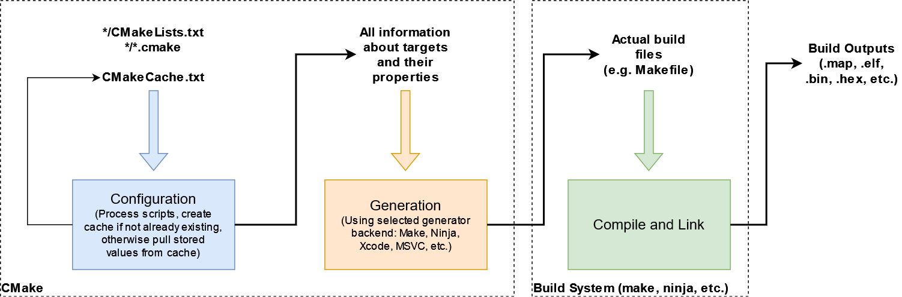
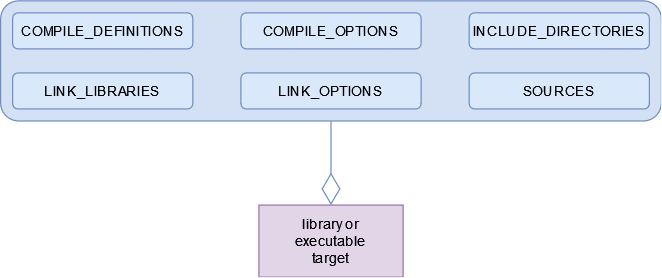
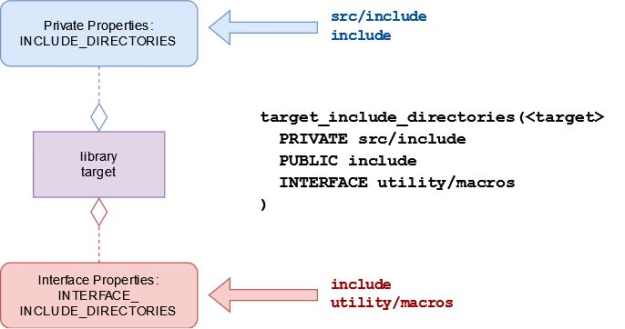
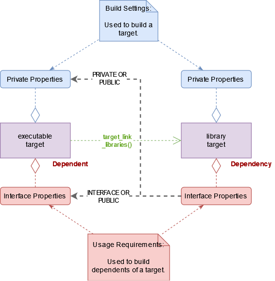

CMake Primer
------------------
The goal of this primer is to cover some of the pain points I struggled with learning CMake.  It is not a full or comprehensive primer.  Nor is it a starting point.  For the basic overview of CMake, I suggest [LLVM's CMake Primer](https://llvm.org/docs/CMakePrimer.html).  However, I do recommend reading this primer along with doing some of your own experimentation before going on to more advanced material.

## Table of Contents

- [Motivation for CMake](#motivation-for-cmake)
- [CMake - The 10,000 Foot View](#cmake---the-10000-foot-view)
- [Prereqs](#prereqs)
- [Variables, Quoting, Functions and Lists](#variables-quoting-functions-and-lists)
- [Targets and Properties](#targets-and-properties)
- [Target Link Libraries](#target-link-libraries)
- [Toolchain Files](#toolchain-files)
- [Setting the Compiler, Linker, and Binutils](#setting-the-compiler-linker-and-binutils)
- [Specifying the Target System and Processor](#specifying-the-target-system-and-processor)
- [Specifying the Build Configuration](#specifying-the-build-configuration)
- [Debugging CMake Scripts](#debugging-cmake-scripts)

## Motivation for CMake
Ugh, what's this?  Yet another build system?  Is this just another _hot new thing_ that everyone is going to forget about in 5 years?  Why should _I_ learn this?  What's in it _for me_?

To understand CMake, we need to understand the problems it's trying to solve.  As pointed out by Hayt in [this Stack Overflow thread](https://stackoverflow.com/questions/40083642/why-do-we-need-cmake), "building things in C++ on different platforms is a mess currently."  That is one of CMake's main selling points, that it's cross-platform.  CMake was started by Bill Hoffman [in response to the need for a cross-platform build environment](https://cmake.org/overview/).

Another issue is that Makefiles on their own [kinda sorta suck](https://dmitryfrank.com/blog/2016/1211_i_am_tired_of_makefiles).  To really be useful they need to be used together with the Unix configure tool or GNU's autoconf, but that's not very portable.  This is another selling point for CMake; it pulls in the configuration functionality.  Running CMake automatically performs the configure stage.

Finally, the world of embedded development is quickly reaching an impasse.  Forget yet another build system.  What I really don't want is _yet another IDE_.  I don't understand why it is that every vendor feels the need to spin their own version of Eclipse when at the end of the day its all just variations of the same wrapper around GCC.  I think there's still this expectation in embedded development that your editor _is_ your build tool.  [Wrong wrong wrong!](https://blog.codinghorror.com/the-f5-key-is-not-a-build-process/)  These are separate concepts.  The build system should be standardizable, codifiable, executable from the command line, and repeatable across machines and from CI (cloud-based or local).  As far as the editor, you can use Notepad for all I care, as long as it doesn't affect the build.  And yes, you _can_ use VS Code and Eclipse as standalone editors and debuggers, _**as long as it doesn't affect the build**_.

Besides the umpteen skinned Eclipses, there is an even bigger problem with the proprietary IDEs.  Yes, I'm talking about the big dogs in the embedded industry, IAR and Keil.  [ARM](https://www.arm.com/) is still pushing [a proprietary IDE](https://developer.arm.com/tools-and-software/embedded/arm-development-studio) on their developer website, which from what I can tell is just the next iteration of Keil.  Don't be fooled.  The GNU ARM toolchain is [available for free](https://developer.arm.com/tools-and-software/open-source-software/developer-tools/gnu-toolchain/gnu-rm/downloads).

The main problem with these proprietary IDEs is how you handle licensing in CI.  These IDEs are premised on the idea of node-locked, dongle-locked, or FlexLM based licenses.  Even Segger Studio, which is "free for Nordic processors" still encounters a problem with CI.  To get the free license, you are required to go through a [node-based registration process](https://wiki.segger.com/Get_a_License_for_Nordic_Semiconductor_Devices).  _Give with one hand.  Take with the other._

So, where am I going with this monologue?

Right... we need a sophisticated, modern command-line based build system which can handle configuration properly and for which we can develop templates that can be reused across projects.  Once we have this, we can forget about the endless deluge of custom IDEs or the intransigent licensing problems that threaten to derail our modernization attempts.  Then at least we stand a chance of developing [mature processes](https://www.electronvector.com/blog/a-maturity-test-for-firmware-organizations).

**[Back to top](#table-of-contents)**

## CMake - The 10,000 Foot View
LLVM's [CMake Primer](https://llvm.org/docs/CMakePrimer.html#ft-view) describes CMake as
> a tool that reads script files in its own language that describe how a software project builds. As CMake evaluates the scripts it constructs an internal representation of the software project. Once the scripts have been fully processed, if there are no errors, CMake will generate build files to actually build the project. CMake supports generating build files for a variety of command line build tools as well as for popular IDEs.

Let's unpack that a bit.  CMake is not the build system itself.  It generates build files for the build system of your choice: make, ninja, MSVC, Xcode, whatever.  Furthermore, CMake has _configuration_ and _generation_ stages.  The configuration stage is similar to autoconf.  During this stage the CMake scripts are processed and checks performed resulting ultimately in a set of information that can be passed to a back-end generator.  A generator exists for each build system that CMake supports.  The generator must be specified when CMake is invoked, otherwise a platform-specific default will be chosen.



CMake is designed only to be rerun as needed.  Once the build files are generated, it is necessary only to invoke the targeted build system (e.g. make or ninja).  The generated build files include dependencies that will rerun CMake _only as needed_.  That is, if you modify the CMakeLists.txt *.cmake files, the CMake command will be rerun, otherwise it will not be.  Furthermore, information about the configuration is cached in the CMakeCache.txt file in your build output folder.  All of this serves to make CMake fast and fully supportive of incremental builds.

**[Back to top](#table-of-contents)**

## Prereqs
Before reading further, go and finish [LLVM's CMake Primer](https://llvm.org/docs/CMakePrimer.html).  It's pretty short and covers some of the basics around language syntax.  The rest of this guide is devoted to clearing up common confusions people encounter when using CMake.  It should be read _after_ the simple primer and _before_ more any more advanced CMake courses.

**[Back to top](#table-of-contents)**

## Variables, Quoting, Functions and Lists
Knowing that all variables are strings is fine and dandy.  Knowing that lists are string variables with `;` separators is great too.  It seems straightforward, until you start reading other CMake and doing some of your own.  Suddenly, questions start to crop up, such as [_when exactly am I supposed to be quoting variable dereferences anyway?_](https://stackoverflow.com/questions/13582282/cmake-difference-between-and)  Is there some kind of rule or something, because _I don't get it!_

Let's clear this up.  There are a few important things to understand about how the CMake language operates that are, well, about _as clear as mud_ in the official CMake documentation.  You won't be able to understand this until you know specifically how each of the four items (variables, quoting, function parameters, and lists) are treated.

First, all variables are treated the same.  That is to say, derefencing a variable using `${}` operates exactly the same whether its string value contains `;`s or not.  It's how some _commands_ treat string values that matters.  It's almost as if lists aren't even part of the base language but rather the scripting commands defined on top of it.

Second, as far as function arguments are concerned, `;`s are just as good a separator as space.  The [language specification for command invocations](https://cmake.org/cmake/help/v3.23/manual/cmake-language.7.html#command-invocations) would not have you believe this.  In fact, that definition seems to deny that `;` can be an argument separator.  Read carefully the [documentation for unquoted arguments](https://cmake.org/cmake/help/v3.23/manual/cmake-language.7.html#unquoted-argument).  It says
> Both Escape Sequences and Variable References are evaluated. The resulting value is divided in the same way Lists divide into elements. Each non-empty element is given to the command invocation as an argument. Therefore an unquoted argument may be given to a command invocation as zero or more arguments.

Note these statements: _The resulting value is divided in the same way lists divide into elements._ ...and... _Each non-empty element is given to the command invocation as an argument._  So, in other words, a dereferenced list variable will be separated into separate elements first and then each of these will be given to the function as a separate argument.  But, here's the thing... _you don't even need to dereference a variable to accomplish this behavior_.  The following two invocations of `foo()` are equivalent.

```
function(foo a b c)
	message(STATUS a)
	message(STATUS b)
	message(STATUS c)
end_function()

foo(1 2 3)
foo(1;2;3)
```

This is what I mean by saying that whether a variable is a list is irrelevant to the dereference operator.  Where that resulting string is placed determines how it is processed.

The third thing to know is that quoting guarantees that a set of characters behaves as one argument.  It will not split on a space or `;`.  That's its main purpose.  Quoting does not prevent variable dereferences or escape sequences.  Thus, if you have a list variable that you want to behave as one argument, you must provide it as a quoted argument (e.g. `foo("${my_list}")`).

**[Back to top](#table-of-contents)**

## Targets and Properties
CMake is a language that is used to describe build targets.  That's its purpose.  These targets are mainly libraries and executables that are created with the `add_library()` and `add_executable()` commands respectively.  Each target has _properties_.  These properties specify how the target is built.


> **Note:** [Properties](https://cmake.org/cmake/help/v3.23/manual/cmake-properties.7.html) are different than [variables](https://cmake.org/cmake/help/v3.23/manual/cmake-variables.7.html).  Properties are always attached to an object, such as directory, test or target (but primarily a target).  Variables have no such attachment and have general visibility to the script.  Sometimes a property is initialized by a variable.  For example, the C_STANDARD property of a target will be initialized by the CMAKE_C_STANDARD variable if it exists when the target is created.

Properties on targets can be broadly classified into two categories: [build specifications and usage requirements](https://cmake.org/cmake/help/v3.23/manual/cmake-buildsystem.7.html#build-specification-and-usage-requirements).
- **Build Specifications** - Specifies how the target should be built.  This includes compiler flags, preprocessor macros, include directories, source files, and so forth.
- **Usage Requirements** - Specifies _additional_ properties needed by _dependents_ of this target.  This would mainly apply to libraries, not executables.  This would be things like include directories or compiler flags needed by a dependent target to correctly link against this target.

When we add properties to a target, we can choose whether those properties apply to the _build specifications_, the _usage requirements_, or both.  We do this using the PUBLIC, PRIVATE, and INTERFACE keywords.  This diagram shows the use of the `target_include_directories()` command to set both public and private include directores.



In this example, `src/include` and `include` are build specifications.  They will be used when building the library.  `include` and `utility/macros` are usage requirements.  They will be used by dependents that link against this library.  Note that usage requirement properties are the same as build specification properties except with the leading `INTERFACE_`.  The PUBLIC, PRIVATE, and INTERFACE keywords can be applied to most properties, not just compiler options and include directories.

We can summarize these keywords as follows.  For demonstration purposes we indicate which properties would be set by the `target_include_directories()` command:
- **PRIVATE:** This is a build specification only.  It will apply to the build of this target but not its dependents.  Only `INCLUDE_DIRECTORIES` is set.
- **PUBLIC:** This is both a build specification and a usage requirement.  It applies to build of this target and any of its dependents.  Both `INCLUDE_DIRECTORIES` and `INTERFACE_INCLUDE_DIRECTORIES` are set.
- **INTERFACE:** This is a usage requirement only.  It is not needed to build this target, but any dependents of this target will require it.  Only `INTERFACE_INCLUDE_DIRECTORIES` is set.

**[Back to top](#table-of-contents)**

## Target Link Libraries
Now it's time to talk about how the usage requirements of a target are applied to its dependents.  This happens through the `target_link_libraries()` command.  `target_link_libraries()` is used to declare one or more dependencies of a target.  Personally, I find the documentation for `target_link_libraries()` hard to follow, and I hope to clear up that confusion here.

Here is the signature for `target_link_libraries()`:
```
target_link_libraries(<target>
                      <PRIVATE|PUBLIC|INTERFACE> <item>...
                     [<PRIVATE|PUBLIC|INTERFACE> <item>...]...)
```

And here is how the CMake documentation describes it:
> The `PUBLIC`, `PRIVATE` and `INTERFACE` keywords can be used to specify both the link dependencies and the link interface in one command. Libraries and targets following `PUBLIC` are linked to, and are made part of the link interface. Libraries and targets following `PRIVATE` are linked to, but are not made part of the link interface. Libraries following `INTERFACE` are appended to the link interface and are not used for linking `<target>`.

Note that we are using different terminology now.  The terms _build specifications_ and _usage requirements_ are notably absent, which is odd considering the page itself starts out talking about _usage requirements_.  Let's clear that up.

When the doc says _linked to_, it is referring to a _build specification_.  It means the build specification properties of `<target>` are being set.  When the doc says _made part of the link interface_, it is referring to a _usage requirement_.  It means the usage requirement properties of `<target>` are being set.  Put another way, the _usage requirement_ of the dependency becomes a _usage requirement_ of `<target>`.  This is called a "transitive link dependency".  It means the usage requirements are being passed transitively across the dependency chain.

This diagram shows the propogation of usage requirements from the library to the dependent target.



Note that the private build specifications of the dependency are never seen by the dependent target.  Only the usage requirements are seen (i.e. the properties starting with `INTERFACE_`).  This works on a property-by-property basis.  So, for example, all macros defined in `INTERFACE_COMPILE_DEFINITIONS` of the library will be added to `COMPILE_DEFINITIONS`, `INTERFACE_COMPILE_DEFINITIONS` or both of the target depending on whether the library dependency was added as `PUBLIC`, `PRIVATE` or `INTERFACE`.

In addition to copying properties from the dependency, `target_link_libraries()` will also create the `LINK_LIBRARIES` and/or `INTERFACE_LINK_LIBRARIES` properties on the target.

**[Back to top](#table-of-contents)**

## Toolchain Files
In addition to the build system (`make`, `ninja`, etc.), CMake needs to know the toolchain it is using.

> CMake uses a toolchain of utilities to compile, link libraries and create archives, and other tasks to drive the build.

For those familiar with GNU family of compilers, this would be gcc plus [binutils](https://sourceware.org/binutils/).  This is what you get when you download the [GNU ARM Toolchain](https://developer.arm.com/tools-and-software/open-source-software/developer-tools/gnu-toolchain/gnu-rm/downloads).

If you do not specify a toolchain, CMake will determine your toolchain based on common defaults (`MSVC` on Windows, `Clang` on Mac OS, etc.).  When cross-compiling, we need to specify the toolchain so that CMake knows how to build for our target hardware.  To do this, CMake _wants_ us to use a toolchain file, _and_ it wants this toolchain file to be provided on the command line.  We do this as follows:
- `cmake ... -DCMAKE_TOOLCHAIN_FILE=<path-to-toolchain-file>` (Any recent version of CMake)
- `cmake ... --toolchain <path-to-toolchain-file>` (CMake 3.21 and newer)

Sometimes people do an `include()` of their toolchain file at the top main `CMakeLists.txt` file.  Or, equivalently, they set the variables intended to be set in the toolchain file at the top of their main `CMakeLists.txt`.  I can't give you the in-depth explanation of why this is bad practice since I am still learning.  I do know that settings related to your build configuration are going to go into your CMake cache and it wants some of that information early.

### Setting the Compiler, Linker, and Binutils
The main variables that should be `set()` are:
- `CMAKE_C_COMPILER` - This needs to be the name of the C compiler as it would be invoked on the command line.  If not in your path, it should be the full path to the compiler you wish to use.
- `CMAKE_CXX_COMPILER` - Same as above, except for the C++ compiler.
- `CMAKE_ASM_COMPILER` - Same as above, except for the assembler.

You may also want to specify some of your binutils.  `CMAKE_OBJDUMP`, `CMAKE_OBJCOPY`, and `CMAKE_SIZE` are the most common for use when cross-compiling.

> Note that setting just one component (i.e. `CMAKE_C_COMPILER`) is enough for CMake to detect the remaining binutils and add them to your cache.  This behavior does not appear to be documented.  In my experiments, CMake automatically discovers the following.
- `CMAKE_ADDR2LINE`
- `CMAKE_AR`
- `CMAKE_ASM_COMPILER`
- `CMAKE_ASM_COMPILER_AR`
- `CMAKE_ASM_COMPILER_RANLIB`
- `CMAKE_CXX_COMPILER`
- `CMAKE_CXX_COMPILER_AR`
- `CMAKE_CXX_COMPILER_RANLIB`
- `CMAKE_C_COMPILER_AR`
- `CMAKE_C_COMPILER_RANLIB`
- `CMAKE_LINKER`
- `CMAKE_NM`
- `CMAKE_OBJCOPY`
- `CMAKE_OBJDUMP`
- `CMAKE_RANLIB`
- `CMAKE_READELF`

One notable absence in the above list is the `size` utility.  If you want access to this utility, it should still be `set()` alongside `CMAKE_C_COMPILER`.

**[Back to top](#table-of-contents)**

### Specifying the Target System and Processor
CMake doesn't _know_ that we're cross-compiling just because we gave it a toolchain file.  After all, we might be compiling a native application using a specific compiler version.  This is common for regulated industries.  In this case, the host and target systems are still the same.  When cross-compiling, we should `set()` the system name and processor.
- `CMAKE_SYSTEM_NAME` - The name of the target system.  For bare-metal embedded targets, use `Generic`.
- `CMAKE_SYSTEM_PROCESSOR` - The target processor family (e.g. `arm`, `x86_64`, `powerpc`, etc.).

CMake will detect whether we are cross-compiling based on `CMAKE_SYSTEM_NAME`.  If not set, it will default to be equal to `CMAKE_HOST_SYSTEM_NAME` (e.g. `Darwin` on Mac OS).  When `CMAKE_SYSTEM_NAME` equals `CMAKE_HOST_SYSTEM_NAME`, it is a native build and CMake automatically sets `CMAKE_CROSSCOMPILING` to false.  When they are not equal, it is a cross-compile and CMake automatically sets `CMAKE_CROSSCOMPILING` to true.

**[Back to top](#table-of-contents)**

### Specifying the Build Configuration
Another thing CMake wants us to do in the toolchain file is specify custom flags for our [build configurations](https://cmake.org/cmake/help/v3.23/manual/cmake-buildsystem.7.html#default-and-custom-configurations) (e.g. `-O3` for `Release` or `-g` for `Debug`).  We do this by setting certain `_INIT` [variables](https://cmake.org/cmake/help/v3.23/variable/CMAKE_LANG_FLAGS_CONFIG_INIT.html).  For example, for `Debug` and `Release` configurations for C and C++, we'd want to set the following four variables.
- `CMAKE_C_FLAGS_DEBUG_INIT`
- `CMAKE_CXX_FLAGS_DEBUG_INIT`
- `CMAKE_C_FLAGS_RELEASE_INIT`
- `CMAKE_CXX_FLAGS_RELEASE_INIT`

Setting our own flags in these `_INIT` variables won't prevent CMake from appending whatever it thinks is appropriate.  For example, if we set `CMAKE_C_FLAGS_DEBUG_INIT` to `-g3`, then the actual
 value assigned to `CMAKE_C_FLAGS_DEBUG` will be `-g3 -g`, which will be forwarded to every compile command in the `Debug` configuration.  To prevent this, we need to _override_ CMake's default behavior, which we do by setting the [`CMAKE_USER_MAKE_RULES_OVERRIDE`](https://cmake.org/cmake/help/v3.23/variable/CMAKE_USER_MAKE_RULES_OVERRIDE.html) variable.  Again, this should be done in the toolchain file.  We use `CMAKE_USER_MAKE_RULES_OVERRIDE` to specify the `.cmake` file where we `set()` all of the `_INIT` variables.

Don't ask me why handling of `_INIT` variables is the way it is or why overriding them properly is so badly documented.  You would think that setting an `_INIT` variable itself is enough to override default behavior, but the documentation [warns](https://cmake.org/cmake/help/v3.23/variable/CMAKE_LANG_FLAGS_CONFIG_INIT.html) this is not the case.

> CMake may prepend or append content to the value based on the environment and target platform.

Anyway, now that we've specified flags for the different build configurations, we can specify the build configuration itself by setting `CMAKE_BUILD_TYPE` on the command line as follows.
- `cmake ... -DCMAKE_BUILD_TYPE=Debug`

We want to specify this on the command line because (at least when generating for `make` and `ninja`), each build output folder can only support one configuration.  Running `make` from that folder will only ever be a `Debug` build, or only ever be a `Release` build, etc.  This means that for different build configurations we need to invoke CMake multiple times to initialize different build resulsts folders.
- `cmake -B build_debug -DCMAKE_TOOLCHAIN_FILE=<path-to-toolchain-file> -CCMAKE_BUILD_TYPE=Debug`
- `cmake -B build_release -DCMAKE_TOOLCHAIN_FILE=<path-to-toolchain-file> -CCMAKE_BUILD_TYPE=Release`

**[Back to top](#table-of-contents)**

## Debugging CMake Scripts
It can be difficult to know what's happening in a CMake script.  When things aren't working correctly, we need some tools to give us visibility.  The bottom line with any CMake script is knowing what compiler (and linker and assembler) commands are being generated.  We can get the full list of compiler commands by adding one very simple statement to our top-level `CMakeLists.txt`.
```
set(CMAKE_EXPORT_COMPILE_COMMANDS ON)
```
This will cause CMake to generate a `compile_commands.json` file in your build output folder.  This can be used to verify the correctness of flags, include paths, and so forth for all compilation units.

Another problem is knowing all the variables that exist and what they're set to.  The global property `_variableNames` can be used to get a list of variable names, which can then be iterated.  This [Stack Overflow post](https://stackoverflow.com/questions/9298278/cmake-print-out-all-accessible-variables-in-a-script) shows how to get the list, sort it, and then iterate over it printing each element.

Finally, we may want to know all of the properties on a target.  This will let us know things like compile options, include paths, and source file list being used for that target.  Again, [Stack Overflow](https://stackoverflow.com/questions/32183975/how-to-print-all-the-properties-of-a-target-in-cmake) demonstrates how to do this.

When it comes to utilities like printing all variables or all properties, I recommend making functions for them and putting them in a debug module.  That way, they can stay out of your main code base and are simply ready when you need them.

**[Back to top](#table-of-contents)**

-----
Copyright &copy; 2022 Aaron Fontaine
